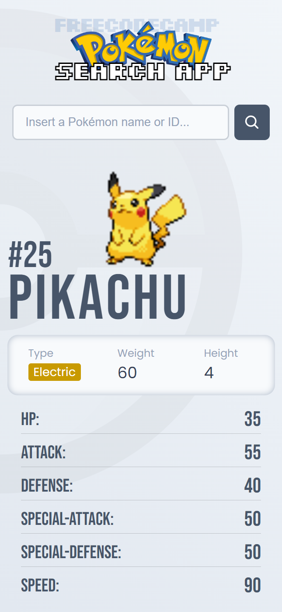
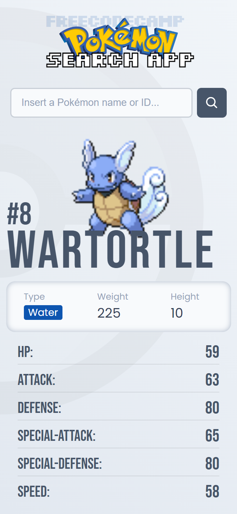

# 

 
 

This Pokémon Search App project was created as a certification requirement for the JavaScript Algorithms and Data Structures course from freeCodeCamp. The objective was to develop an application that allows users to search for Pokémon by name or ID and display relevant details such as type, weight, height, and stats. The app retrieves data from the freeCodeCamp PokéAPI Proxy and provides an engaging and interactive interface for Pokémon enthusiasts.

> [!IMPORTANT]
> This project is part of the freeCodeCamp JavaScript Algorithms and Data Structures course. Although freeCodeCamp provides guidelines and user stories for certification projects, it does not offer tutorials or step-by-step guides for development. This project was built entirely from scratch using my own approach to meet the requirements.

 Screenshots

  
    

    
&nbsp;
    
&nbsp;
    

## 📝 Project Objective

The objective of this project was to create a Pokémon search app similar to the <a href="https://pokemon-search-app.freecodecamp.rocks/">example provided by freeCodeCamp</a>. The app allows users to search for Pokémon by name or ID and displays various details, including the Pokémon's name, type, weight, height, and base stats such as HP, Attack, Defense, and Speed. It also displays the Pokémon's front sprite image and handles cases where a Pokémon is not found. This project was an opportunity to practice **Fetch API**, **asynchronous programming**, and **promises**, which were covered in the last module of the course.

## 🔧 Features

- **Input Field**: An `input` element with id `search-input` where users can enter the Pokémon name or ID.

- **Search Button**: A `button` element with id `search-button` that initiates the search when clicked.

- **Pokémon Details**: Elements to display the Pokémon's details:

  - `#pokemon-name` for the name.

  - `#pokemon-id` for the ID.

  - `#weight` for the weight.

  - `#height` for the height.

  - `#hp`, `#attack`, `#defense`, `#special-attack`, `#special-defense`, and `#speed` for the Pokémon’s base stats.

  - `#types` for the Pokémon's type(s), which changes background color dynamically based on the type.

  - A dynamically added `img` element with id `sprite` to display the Pokémon’s sprite image.

- **Error Handling**: If the Pokémon is not found (e.g., the user enters "Red"), an alert with the message "Pokémon not found" is displayed.

- **Dynamic Type Coloring**: Each Pokémon's type is highlighted with a background color that corresponds to its type, making the UI more engaging.

## 📖 Learnings

- **Fetch API and Asynchronous Programming**: This project required the use of the Fetch API to retrieve Pokémon data from the PokéAPI proxy. Asynchronous functions were utilized to handle the API requests and responses.

- **DOM Manipulation**: The project involved updating various elements dynamically based on the search results. This improved my understanding of how to manipulate the DOM in response to user inputs.

- **Error Handling**: Learned to handle errors gracefully, including cases where the Pokémon is not found, and ensuring the UI remains functional.

- **Type Handling and Styling**: Implemented dynamic styling for Pokémon types, which required creating a map of types to colors and applying it based on the type returned by the API.

## 💻 Technologies Used

- **HTML5** for structuring the application.

- **CSS3** for styling and providing visual feedback for Pokémon types and error messages.

- **JavaScript** for functionality, including handling user inputs, fetching data, DOM manipulation, and asynchronous processing.

## 💡 Acknowledgments

- **freeCodeCamp**: For providing the project guidelines and user stories that served as the basis for this application.

- **PokéAPI**: For providing the comprehensive Pokémon data, which was accessed through the freeCodeCamp PokéAPI Proxy.